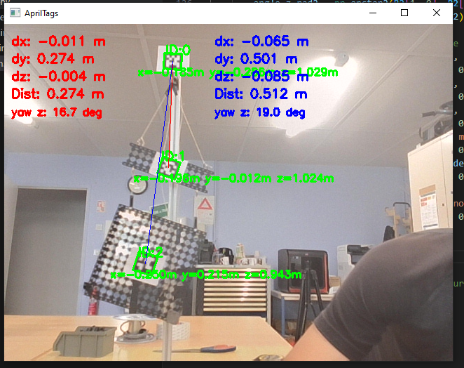

# AprilTag Vision / Vision par AprilTag

Détection d'AprilTags avec estimation de pose en temps réel via une webcam. Le programme utilise OpenCV, NumPy et la bibliothèque `pupil_apriltags` pour identifier plusieurs tags, afficher leur position (x, y, z), leur rotation autour de l’axe Z, et la distance entre eux.

Real-time AprilTags detection with pose estimation via webcam. The program uses OpenCV, NumPy, and the `pupil_apriltags` library to identify multiple tags, display their position (x, y, z), their rotation around the Z-axis, and the distance between them.



## 🔧 Prérequis / Prerequisites

- Python 3.10 ou supérieur / Python 3.10 or higher
- [Poetry](https://python-poetry.org/) (gestionnaire de dépendances / dependency manager)

## 📦 Installation

1. Clone ce dépôt / Clone this repository:

```bash
git clone https://github.com/tintin75011/apriltag-vision.git
cd apriltag-vision
```
2. Créez un environnement virtuel et activez-le / Create a virtual environment and activate it:
 ```bash
python -m venv venv
venv\Scripts\activate
```

3. Installez les dépendances avec Poetry / Install dependencies with Poetry:

```bash
pip install poetry
poetry install
```

4. Lancez le script principal / Run the main script:
```bash
poetry run python main.py
```

## 📷 Fonctionnalités / Features

- 🎯 Détection d’AprilTags via webcam / AprilTags detection via webcam
- 📍 Estimation de la position `(x, y, z)`  pour chaque tag détecté / Position estimation `(x, y, z)` for each detected tag
- 📏 Affichage de la distance et des décalages entre les tags `0`, `1` et `2` / Display of distance and offsets between tags `0`, `1` and `2`
- 🔄 Affichage de la rotation autour de l'axe **Z** / Display of rotation around the **Z** axis
- 🧵 Trait visuel entre les centres des tags / Visual line between the centers of the tags

---

## 🛠 Technologies utilisées / Technologies Used

- `opencv-python`
- `numpy`
- `pupil-apriltags`

---

## 📜 Licence / License

**MIT License** – libre à toi de modifier, partager ou intégrer ce projet dans le tien ! / **MIT License** – feel free to modify, share, or integrate this project into yours!
